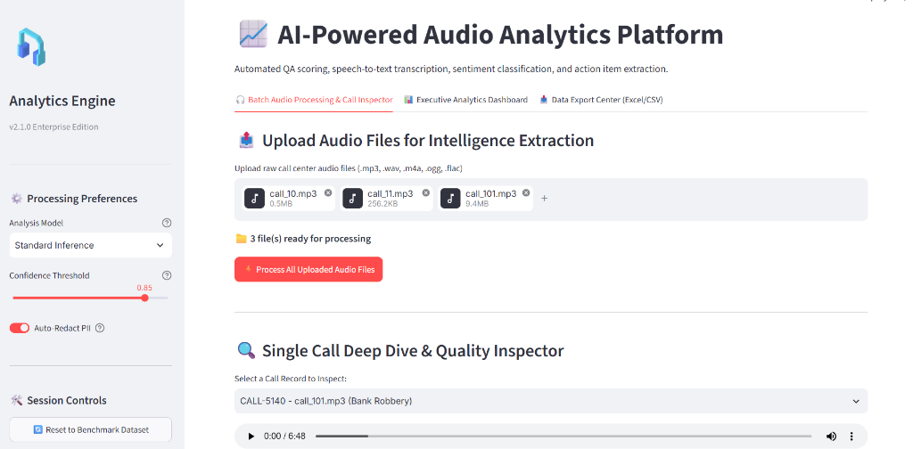
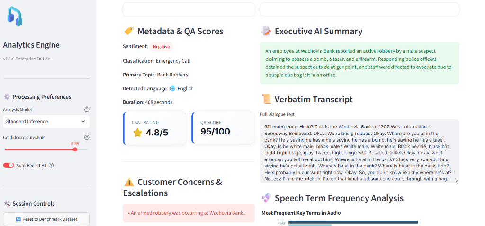
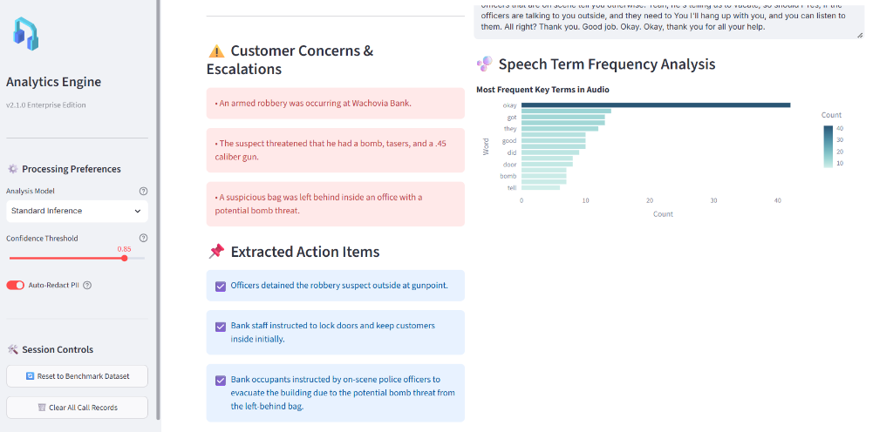
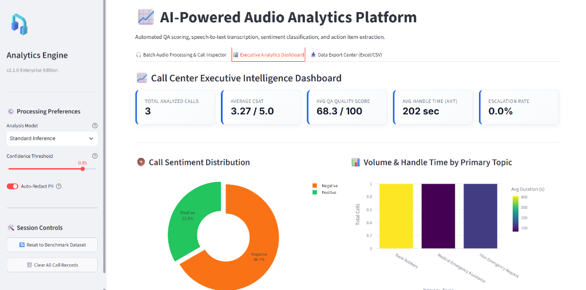
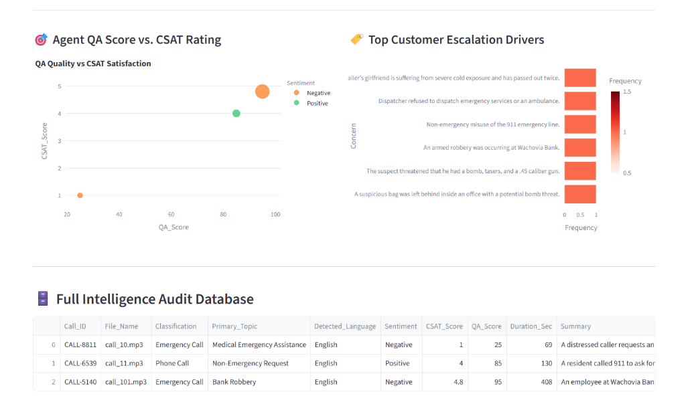

# 🎙️ AI-Powered Audio Analytics Platform

An enterprise-grade intelligence solution designed to revolutionize call center operations. This platform automatically processes raw audio calls, extracting critical intelligence such as sentiment, Quality Assurance (QA) scores, Customer Satisfaction (CSAT) ratings, verbatim transcripts, and actionable items using Google's Multi-Modal AI.

---

## 🎥 Platform Demonstration
> **Note:** [Insert your AI-generated promotional video or GIF here]

---

## 💡 The Problem vs. Our Solution

**The Challenge:** Modern call centers ingest thousands of hours of audio daily. Manually reviewing these calls for quality assurance, compliance, and customer satisfaction is inherently slow, expensive, and highly prone to human error. Critical customer concerns and actionable follow-ups frequently slip through the cracks.

**The Solution:** An automated, AI-driven pipeline that ingests audio, analyzes speech contextually, and outputs structured, actionable intelligence in seconds. By automating QA and CSAT scoring, managers can focus on coaching rather than listening to endless call recordings.

---

## 🚀 Key Capabilities

- **Batch Audio Processing:** Upload multiple audio files (`.mp3`, `.wav`, `.m4a`) for simultaneous, parallel processing.
- **Speech-to-Text Transcription:** Highly accurate verbatim transcription of dialogues with automatic language detection.
- **Sentiment & Escalation Analysis:** Automatically flags negative interactions, escalated calls, and acute customer concerns.
- **Automated QA & CSAT Scoring:** Uses AI to dynamically grade agent performance and estimate customer satisfaction out of 100 and 5.0 respectively.
- **Action Item Extraction:** Generates concrete next steps and follow-up tasks directly from the conversation context.
- **Executive Analytics Dashboard:** Aggregates call data into beautiful, high-level metrics (AHT, Escalation Rate, Volume by Topic) for management review.
- **Data Export Center:** Seamlessly export full intelligence reports and action-item checklists to CSV or Excel.

---

## 🔍 Platform Walkthrough

### 1. Batch Audio Processing & Inspection
Upload raw call center audio files directly into the platform. The engine supports various formats and processes them in batch, preparing them for deep analysis.

### 2. Deep Dive: Metadata, Summaries & Transcripts
For any selected call, instantly view a comprehensive breakdown. This includes an Executive AI Summary, a full verbatim transcript, and automatically generated QA/CSAT scores.

### 3. Customer Concerns & Extracted Action Items
Never miss a critical follow-up. The platform isolates exact customer concerns and extracts explicit action items (e.g., "Officers detained the robbery suspect") for the team to execute.

### 4. Executive Analytics Dashboard
A high-level view for management. Track total analyzed calls, average CSAT, average QA scores, and sentiment distribution across the entire call center floor.

### 5. Advanced Driver Analysis & Audit Database
Identify what drives escalations. The platform visualizes top escalation drivers and provides a searchable, full intelligence audit database of all processed calls.

---

## ⚙️ Configuration & Enterprise Security
The platform is built with enterprise security in mind. API keys are handled securely via environment variables (`.env`), keeping secrets out of the UI. 

The sidebar features dynamic processing preferences, allowing administrators to:
- Toggle between **Standard Inference** and **Deep Reasoning Models**.
- Adjust **Confidence Thresholds** for flagging critical items.
- Enable automatic **PII (Personally Identifiable Information) Redaction** to protect consumer data.

---

## 🛠️ Technology Stack
- **Frontend / UI:** Streamlit, Custom Responsive CSS
- **Data Visualization:** Plotly (Express & Graph Objects)
- **Data Processing:** Pandas, NumPy
- **AI/ML Engine:** Google Gemini Multi-Modal Models
- **Environment Management:** Python `dotenv`

---

*Note: This repository serves as a portfolio demonstration of the AI-Powered Audio Analytics Platform UI and architecture.*
