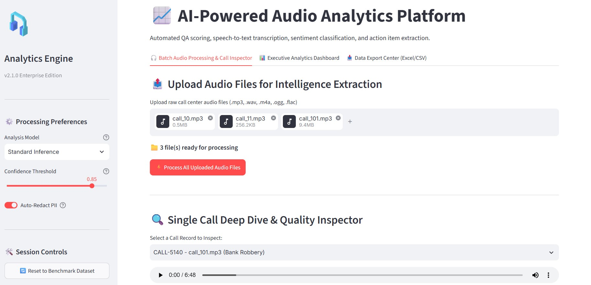
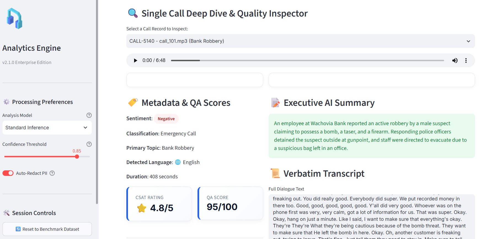
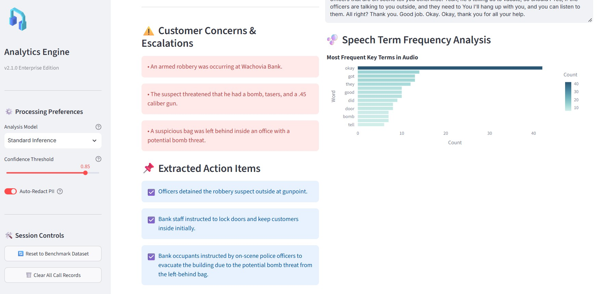
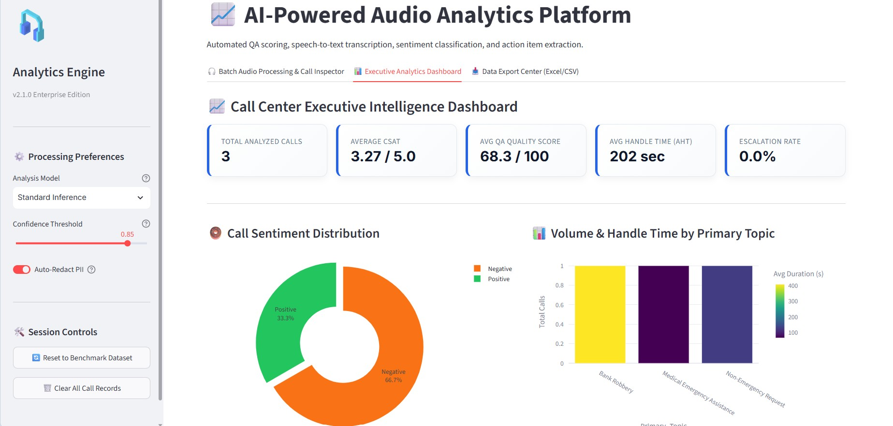
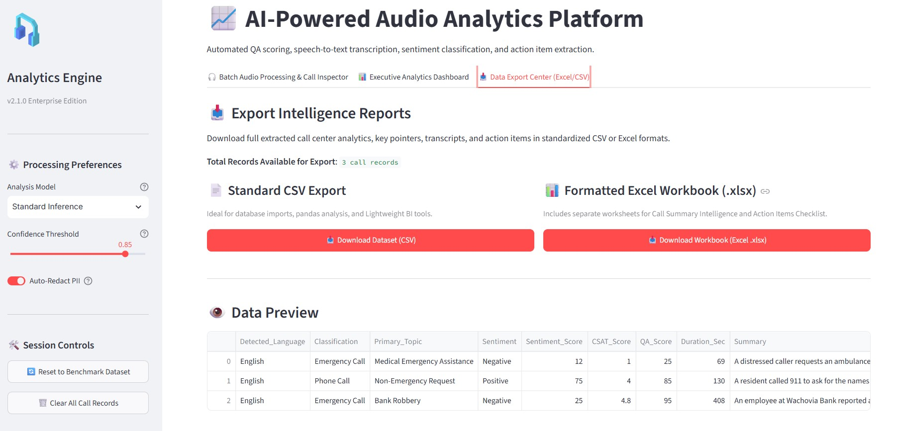

# 🎙️ AI-Powered Audio Analytics Platform

**An enterprise-grade intelligence solution to revolutionize call center operations.**

*Transforming raw audio into structured, actionable intelligence in seconds.*

---

## 🎥 Platform Demonstration

> **Watch the platform in action!** 
> 
> *(Drag and drop your video file right here in the GitHub Web Editor!)*

---

## 💡 The Vision

### 🚧 The Challenge
Modern call centers ingest thousands of hours of audio daily. Manually reviewing these calls for **Quality Assurance (QA)**, **compliance**, and **Customer Satisfaction (CSAT)** is inherently slow, expensive, and highly prone to human error. Critical customer concerns and actionable follow-ups frequently slip through the cracks.

### ✨ Our Solution
An automated, AI-driven pipeline that ingests audio, analyzes speech contextually, and outputs structured intelligence. By automating QA and CSAT scoring, managers can focus on **coaching** rather than listening to endless recordings.

---

## 🚀 Key Capabilities

| Feature | Description |
| :--- | :--- |
| 🗂️ **Batch Processing** | Upload multiple audio files (`.mp3`, `.wav`, `.m4a`) for simultaneous, parallel processing. |
| 📝 **Speech-to-Text** | Highly accurate verbatim transcription of dialogues with automatic language detection. |
| 🚨 **Sentiment Analysis** | Automatically flags negative interactions, escalated calls, and acute customer concerns. |
| 📊 **Dynamic QA & CSAT** | Uses AI to grade agent performance (out of 100) and estimate customer satisfaction (out of 5.0). |
| 📌 **Action Extraction** | Generates concrete next steps and follow-up tasks directly from the conversation context. |
| 📈 **Executive Dashboard** | Aggregates call data into beautiful metrics (AHT, Escalation Rate) for management review. |

---

## 🔍 Platform Walkthrough

### 1. Batch Audio Processing & Inspection
Upload raw call center audio files directly into the platform. The engine processes them in batch, preparing them for deep analysis.

  

 

### 2. Deep Dive: Metadata, Summaries & Transcripts
For any selected call, instantly view a comprehensive breakdown. This includes an Executive AI Summary, a full verbatim transcript, and automatically generated QA/CSAT scores.

  

 

### 3. Customer Concerns & Extracted Action Items
Never miss a critical follow-up. The platform isolates exact customer concerns and extracts explicit action items for the team to execute.

  

 

### 4. Executive Analytics Dashboard
A high-level view for management. Track total analyzed calls, average CSAT, average QA scores, and sentiment distribution across the entire call center floor.

  

 

### 5. Advanced Driver Analysis & Audit Database
Identify what drives escalations. The platform visualizes top escalation drivers and provides a searchable, full intelligence audit database of all processed calls.

  

---

## ⚙️ Enterprise Configuration & Security

Built with enterprise security in mind, the platform ensures that secrets remain out of the UI. The secure sidebar features dynamic processing preferences, allowing administrators to:

- 🧠 **Toggle AI Models:** Switch between *Standard Inference* and *Deep Reasoning Models*.
- 🎚️ **Adjust Thresholds:** Dynamically alter the confidence threshold required for flagging critical items.
- 🔒 **Auto-Redact PII:** Enable automatic *Personally Identifiable Information (PII)* redaction to protect sensitive consumer data.

---

## 🛠️ Technology Stack

- **Frontend / UI:** Streamlit, Custom Responsive CSS
- **Data Visualization:** Plotly (Express & Graph Objects)
- **Data Processing:** Pandas, NumPy
- **AI/ML Engine:** Google Gemini Multi-Modal Models
- **Environment Management:** Python `dotenv`
